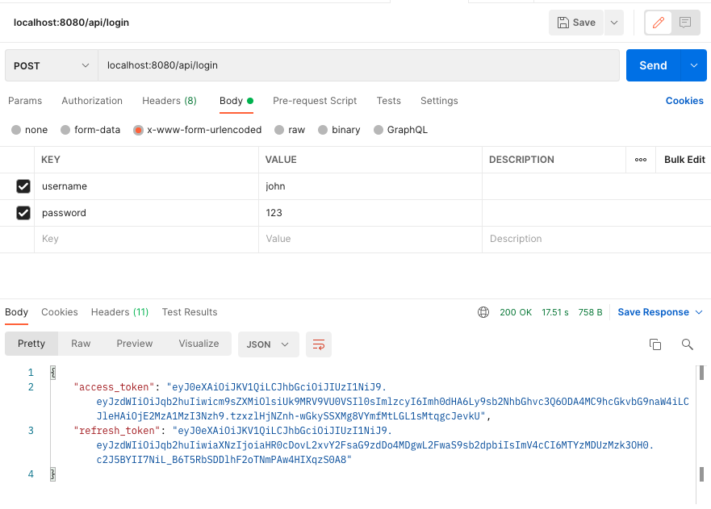
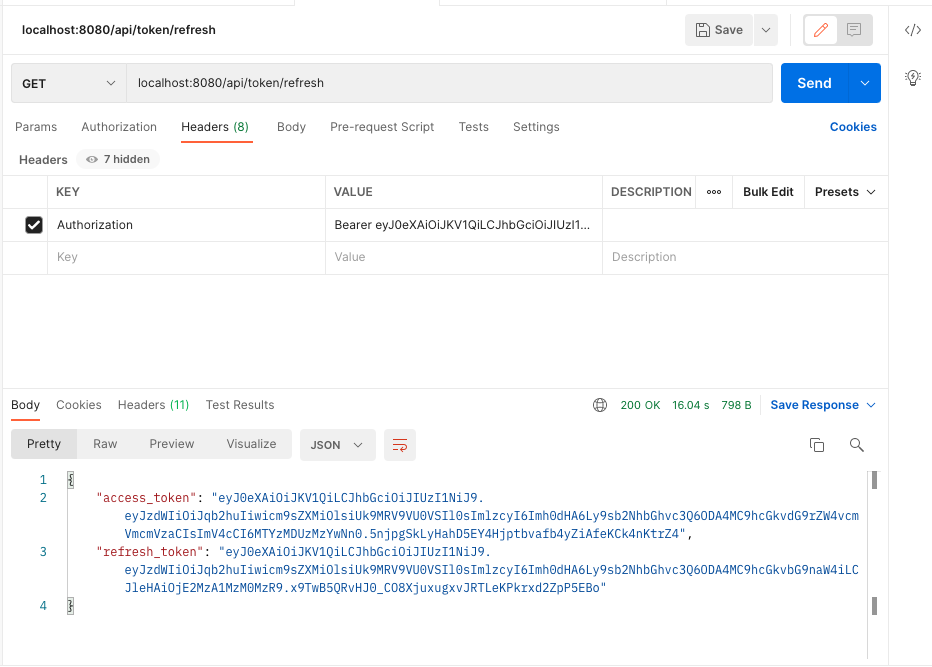
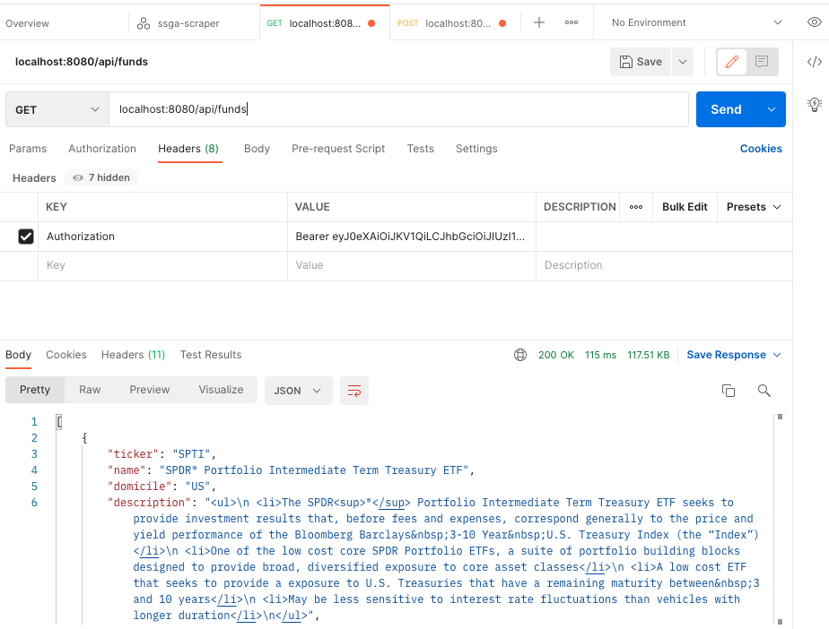
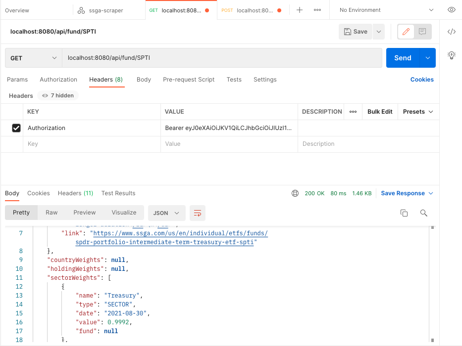

# SSGA Scrapper Service

Scraps some funds info from https://www.ssga.com portal. For more details check 
`com.orbis.ssgascraper.ScraperMain` class.

### Service Info
Service is globally available by address
```
137.184.47.136:8080
```

### Main Endpoints

* `POST 137.184.47.136:8080/api/login` - to get access token

  
* `GET 137.184.47.136:8080/api/token/refresh` - to refresh token

  
* `GET 137.184.47.136:8080/api/funds` - to get funds list

  
* `GET 137.184.47.136:8080/api/fund/{TICKER}` - to get detailed info for 
  fund with `TICKER` name


### Deployment & Mng Commands

Step 1. Build the project with command:
```shell
./mvnw clean package
```

Step 2. Create a keypair:
```shell
ssh-keygen -t rsa -b 4096 -C “your-email@somedomain.com” -f ./key/id_rsa
```

Arifact should be located in folder `./target/`
e.g. (`./target/ssga-scraper-0.0.1-SNAPSHOT.jar`)

Step 3. Create a Droplet (Virtual Machine) based on ubuntu 20.04.
Use key pair created on Step 2/

Step 4. SSH to the machine and do the following

```shell
ssh -i key/id_rsa root@<IP Address of the Droplet>
```

Step 5. Configure droplet (after sshing to it):

```shell
sudo apt update
sudo apt install openjdk-8-jre-headless
java -version
```

Step 6. Create artifact dir and move compiled project there:
```shell
mkdir /artifact
```

Copy project
```shell
scp -i key/id_rsa demo/target/ssga-scraper-0.0.1-SNAPSHOT.jar root@<IP Address of the Droplet>:/artifact
scp -i key/id_rsa ssga-scraper-spring-boot.service root@<IP Address of the Droplet>:/etc/systemd/system
```

Step 7. 
Run a service:
```shell
systemctl start ssga-scraper-spring-boot.service
```

Step 8. 
Enable service auto start in case Droplet is restarted:
```shell
systemctl enable ssga-scraper-spring-boot.service
```

Step 9.
To check server logs:
```shell
journalctl -u ssga-scraper-spring-boot.service
```

or 
```shell
journalctl -u ssga-scraper-spring-boot.service --no-pager
```

To restart service
```shell
sudo systemctl restart ssga-scraper-spring-boot.service
```

To reload config
```shell
systemctl daemon-reload
```